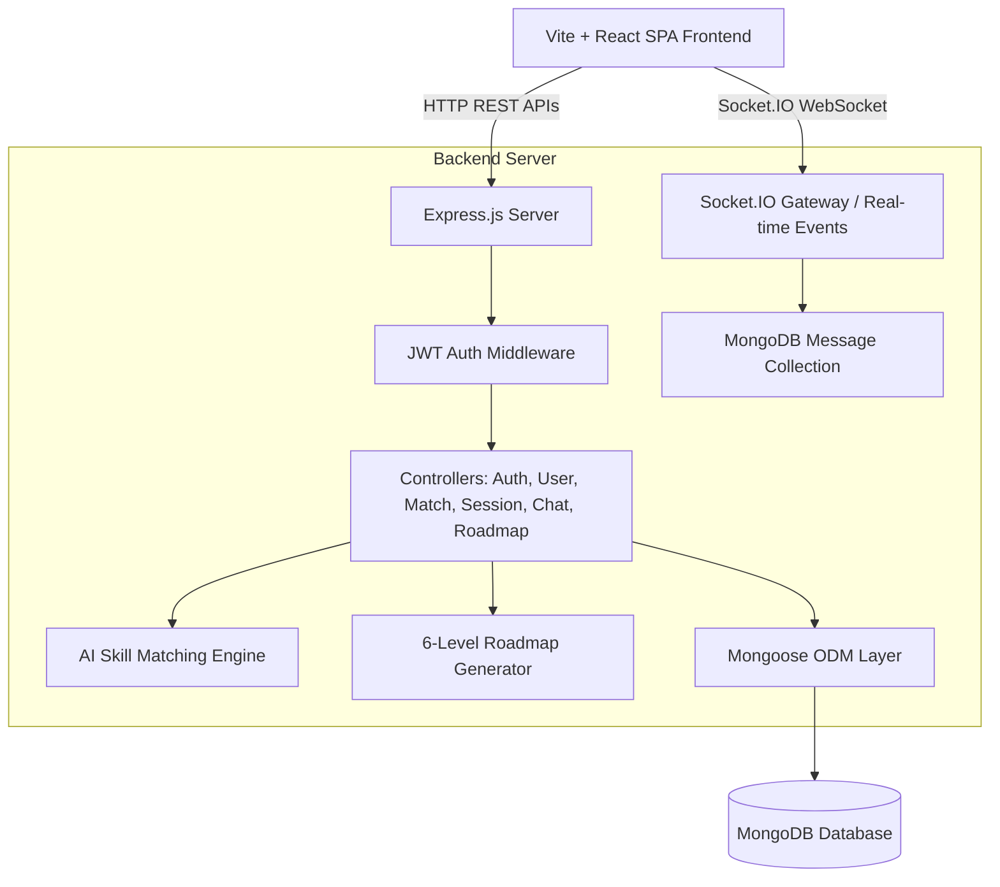
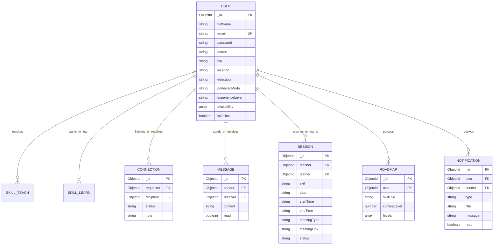

# SkillSwap AI — Intelligent Peer-to-Peer Skill Exchange & Collaborative Learning Platform

[](file:///e:/CHARUSAT/SEM%207/New%20folder%20(2)/README.md)
[](file:///e:/CHARUSAT/SEM%207/New%20folder%20(2)/README.md)
[](file:///e:/CHARUSAT/SEM%207/New%20folder%20(2)/README.md)

SkillSwap AI is a full-stack, portfolio-ready web application built as a **5-month B.Tech 7th-Semester Computer Engineering Project**. It enables students and learners to exchange skills 1-on-1 through intelligent AI matching, real-time Socket.IO chat, session scheduling, interactive 6-level roadmaps, and progress tracking.

---

## 📋 Table of Contents

- [1. Project Overview](#1-project-overview)
- [2. Academic Review Roadmap](#2-academic-review-roadmap)
- [3. Problem Statement & Objectives](#3-problem-statement--objectives)
- [4. System Architecture](#4-system-architecture)
- [5. Database Architecture & ER Diagram](#5-database-architecture--er-diagram)
- [6. AI Skill Matching Methodology](#6-ai-skill-matching-methodology)
- [7. Core Features & Modules](#7-core-features--modules)
- [8. Technology Stack](#8-technology-stack)
- [9. API Endpoint Reference](#9-api-endpoint-reference)
- [10. Installation & Setup Guide](#10-installation--setup-guide)
- [11. Seeding Realistic Demo Data](#11-seeding-realistic-demo-data)
- [12. Running Tests](#12-running-tests)
- [13. Future Enhancements](#13-future-enhancements)

---

## 1. Project Overview

Conventional learning platforms are often one-directional (video lectures) or prohibitively expensive for students seeking personalized mentorship. **SkillSwap AI** introduces a bidirectional peer-to-peer exchange economy where every user is both a teacher and a learner.

For instance, if **User A** teaches *React.js* and wants to learn *Python*, while **User B** teaches *Python* and wants to learn *React.js*, SkillSwap AI calculates a high mutual fit score (95%+), itemizes compatibility reasons, and facilitates instant connection, real-time chat, and scheduled learning sessions.

---

## 2. Academic Review Roadmap

Structured specifically to meet university project evaluation milestones:

### 🔹 Review 1 — Planning & Requirements Analysis
- **Problem Statement & Scope Definition**: Identifying gaps in existing learning platforms.
- **Literature Survey**: Comparing Coursera, Udemy, Tandem, and Stack Overflow.
- **Requirements Engineering**: Functional (Auth, Profiles, AI Matcher, Chat, Sessions, Roadmaps) & Non-Functional (Latency < 100ms for chat, JWT security, responsive UI).
- **Technology Feasibility**: Stack evaluation (MongoDB, Express, React, Node.js, Socket.IO, Vite).

### 🔹 Review 2 — Design & Initial Implementation
- **Architecture & System Design**: Layered REST API architecture & WebSocket socket gateway.
- **Database ER Design**: 7 relational Mongoose models (User, Skill, Connection, Message, Session, Roadmap, Notification).
- **Authentication System**: Secure JWT token generation, bcrypt password hashing, and authorization middlewares.
- **Initial Profile & Skill CRUD**: Taxonomy categorization and skill management APIs.

### 🔹 Final Phase — Complete Deployment & Testing
- **Multi-Criteria AI Skill Matcher**: Heuristic scoring engine (0–100%) with weighted criteria.
- **Real-Time Communication**: Socket.IO 1-on-1 chat with typing state and online indicators.
- **Session Scheduling**: Booking 1-on-1 swap sessions with Google Meet links.
- **Personalized Skill Roadmaps**: Interactive 6-level milestone topic completion.
- **Verification**: 11/11 automated unit/integration test assertions passing cleanly.

---

## 3. Problem Statement & Objectives

### Problem Statement
Most online educational platforms rely on passive video watching without interactive feedback or require expensive paid tutoring. Peer-to-peer learning exists informally but lacks structured matching algorithms, progress tracking, and session coordination tools.

### Objectives
1. Build an intelligent matching engine that pairs complementary skill supply and demand.
2. Provide real-time Socket.IO chat for instant communication.
3. Enable 1-on-1 learning session scheduling with status tracking.
4. Supply structured 6-level roadmaps to keep learners on track.
5. Demonstrate production software engineering practices (JWT, bcrypt, MongoDB indexing, modular React component architecture).

---

## 4. System Architecture



---

## 5. Database Architecture & ER Diagram



---

## 6. AI Skill Matching Methodology

The AI Skill Matcher calculates mutual fit percentage (0–100%) using a weighted multi-criteria formula:

$$\text{Match Score} = S_{\text{skill}} (40\%) + S_{\text{prof}} (20\%) + S_{\text{exp}} (15\%) + S_{\text{avail}} (15\%) + S_{\text{mode}} (10\%)$$

### Weight Breakdown
1. **Mutual Skill Fit ($S_{\text{skill}} - 40\%$)**: Checks if Candidate teaches what User wants to learn AND User teaches what Candidate wants to learn.
2. **Proficiency Alignment ($S_{\text{prof}} - 20\%$)**: Evaluates if teacher's level meets or exceeds learner's target level.
3. **Experience Compatibility ($S_{\text{exp}} - 15\%$)**: Compares overall background years.
4. **Availability Overlap ($S_{\text{avail}} - 15\%$)**: Measures common schedule slots (Weekends, Evenings).
5. **Mode & Interest Synergy ($S_{\text{mode}} - 10\%$)**: Preferred learning mode (Online/Offline/Hybrid) and shared domain interests.

### Pluggable Architecture
Designed with an adapter pattern: if an external AI LLM API (e.g. Gemini / OpenAI) is connected in the future, it can serve as the primary recommendation provider while this heuristic engine remains as a reliable offline fallback.

---

## 7. Core Features & Modules

- **JWT Authentication & bcrypt Security**: Password hashing with 10 salt rounds and protected route guards.
- **User Profile & Taxonomy Management**: Custom avatar, bio, location, education, skills, proficiency levels, availability.
- **Discover Directory**: Real-time search with multi-filters (Category, Proficiency, Schedule, Mode).
- **AI Recommendations Page**: Displaying match scores, breakdown percentages, visual reason checkmarks, and connect triggers.
- **Connection Request Network**: Send, accept, decline, and cancel pending requests.
- **Real-Time Socket.IO Chat**: 1-on-1 messaging, online/offline status indicators, typing state, unread counts.
- **1-on-1 Session Scheduling**: Book sessions with date/time pickers, meeting links, notes, and status updates (Scheduled/Completed/Cancelled).
- **Personalized 6-Level Skill Roadmaps**: Topic milestone checklists, completion checkboxes, and dynamic progress bar.
- **Notification Feed**: Live socket and database notifications for requests, messages, and sessions.

---

## 8. Technology Stack

- **Frontend**: React 18, Vite, Javascript, Tailwind CSS, Lucide Icons, Axios, React Router DOM.
- **Backend**: Node.js, Express.js, Socket.IO, JWT, bcryptjs, Mongoose.
- **Database**: MongoDB (Local or Atlas).

---

## 9. API Endpoint Reference

### Authentication
- `POST /api/auth/register` — Register new user account
- `POST /api/auth/login` — Authenticate and return JWT token
- `GET /api/auth/me` — Fetch current user profile

### User Directory & Profiles
- `GET /api/users` — Search and filter candidates
- `GET /api/users/:id` — Get user profile by ID
- `PUT /api/users/profile` — Update logged in user profile & skills

### AI Recommendations
- `GET /api/recommendations` — Get ranked match recommendations
- `GET /api/recommendations/:userId` — Get detailed fit breakdown for user

### Connections
- `GET /api/connections` — List accepted connections & pending requests
- `POST /api/connections/request` — Send connection request
- `PUT /api/connections/:id/accept` — Accept connection request
- `PUT /api/connections/:id/reject` — Reject connection request
- `DELETE /api/connections/:id` — Remove connection

### Messages (Socket.IO & REST)
- `GET /api/messages/conversations` — Fetch conversation list
- `GET /api/messages/:userId` — Fetch chat history with user
- `POST /api/messages` — Send message (REST fallback)

### Sessions
- `GET /api/sessions` — Get scheduled & past sessions
- `POST /api/sessions` — Book new learning session
- `PUT /api/sessions/:id` — Update session status
- `DELETE /api/sessions/:id` — Cancel session

### Roadmaps
- `GET /api/roadmaps/my` — Get user's enrolled roadmaps
- `POST /api/roadmaps` — Enroll in a skill & generate 6-level roadmap
- `PUT /api/roadmaps/:id/topic` — Toggle topic completion checkbox
- `DELETE /api/roadmaps/:id` — Delete roadmap

---

## 10. Installation & Setup Guide

### Prerequisites
- **Node.js**: v18.0 or higher (`node -v`)
- **MongoDB**: Local MongoDB service running on `mongodb://127.0.0.1:27017` or MongoDB Atlas connection string.

### Step 1: Clone & Configure Server
```bash
cd server
npm install
```

Create `server/.env`:
```env
PORT=5000
MONGO_URI=mongodb://127.0.0.1:27017/skillswap_ai
JWT_SECRET=skillswap_ai_super_secret_jwt_key_2026_btech
CLIENT_URL=http://localhost:5173
NODE_ENV=development
```

### Step 2: Configure Client
```bash
cd ../client
npm install
```

---

## 11. Seeding Realistic Demo Data

To populate the database with **10+ realistic demo users**, skills taxonomy, connections, chat history, scheduled sessions, active roadmaps, and notifications for instant presentation:

```bash
cd server
npm run seed
```

### Demo Accounts for Quick Login
- `alex@example.com` | `password123` (React.js Teacher, Python Learner)
- `sophia@example.com` | `password123` (Python & ML Teacher, React Learner)
- `marcus@example.com` | `password123` (Cyber Security Expert)
- `priya@example.com` | `password123` (Node.js & MongoDB Specialist)

---

## 12. Running the Application

### Start Backend Server
```bash
cd server
npm run dev
# Server running on http://localhost:5000
```

### Start Frontend Vite Client
```bash
cd client
npm run dev
# Client running on http://localhost:5173
```

---

## 13. Running Tests

Execute the automated verification test suite:
```bash
cd server
npm test
```
Outputs assertion pass rates for AI matching calculations, recommendation ranking, and dynamic roadmap generation.

---

## 14. Future Enhancements

1. Integration with Gemini API for LLM-powered natural language chat advisor.
2. WebRTC Video Call Integration for embedded video sessions.
3. Peer Review & Badge Certification System upon roadmap completion.

---

## 🎓 Academic Credits

**B.Tech 7th Semester Computer Engineering Project**  
Department of Computer Engineering  
Academic Year: 2026
